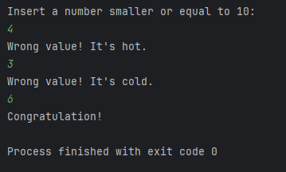

# Random Number Guesser

This is one of my first ever project in Python. It is a pretty straight forward app that will generate a number between 1 and 10 and you have 3 chances to guess it.

## Table of content

- [Installation](#installation)
- [Usage](#Usage)

## Installation

1. Clone the repository.

## Usage

1. Run the application, it will generate a random number between 1 and 10.
2. Insert your first guess. If the number you inserted is different from the correct number by 3 or more, the app will let you know that your guess is cold. If the difference is smaller than 3, the program will tell you that your guess is hot.
3. Insert your remaining guesses. You have 3 chances, after which, the program will tell you the correct number.

An example of a run

